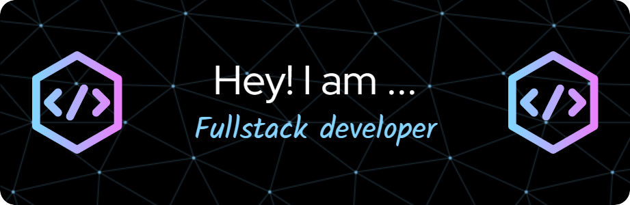

  <ul align="center" style="list-style: none">
    

      <h1>
        👋 Hi, my name is Diego Mesa
      </h1>
    

  </ul>

**<h3 align="left">Connect with me:</h3>** 

 

 **<h3 align="left">🚀 Passionate full stack web developer, who enjoys turning complex ideas into clean, functional, and user-friendly web applications.  I’ve had the chance to build everything from responsive dashboards and interactive tools to full-featured mobile-friendly systems.  I’m Skilled in both front-end and back-end technologies, with a keen eye for user experience and performance optimization.</h3>**

 **<h3 align="left">Skills</h3>**

 
 
 
 
 
 
 
 
 
 
 
 
 
 
  

